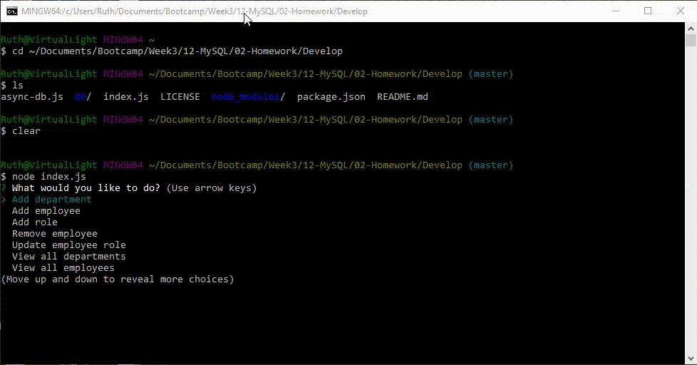

# Employee Tracker (Content Management System)
This command-line application manages a company's employees using node, inquirer, and MySQL.

### Prerequisites
  * Git terminal
  * Node
  * MySQL and MySQL Workbench (or the terminal instead of MySQL Workbench)

## Running the tests
There is no automated test suite for this command line application. Instead, I ran the following manual tests. 

### Manual tests
    1. "View all employees"
    2. "View all employees by department"
    3. "View all roles"
    4. "View all departments"
    5. "Add department" followed by "View all departments" to confirm that the new department is there.
    6. "Add employee" followed by "View all employees" to confirm that the new employee is there. 
    7. "Add role" followed by "View all roles" to confirm.
    8. "Remove employee" followed by "View all employees" to confirm.
    9. "Update employee role" followed by "View all employees" to confirm.

You can see these tests run by viewing the provided GIF file 
 

## Deployment
To deploy this on a live system, copy all of the files to your computer and follow the instructions in the "Installing" section followed by the "Getting Started" section. This is a command-line tool, not one that runs in the browser. There are no live pages to demonstrate. 

You can see these tests run by viewing the provided animated GIF file 
 

## Built With
* [Visual Studio Code] https://code.visualstudio.com/docs/setup/setup-overview
* [Visual Studio Code Extension "Open in Browser"] 
    * Open VS Code.
    * Open the extensions pane and search for open in browser.
    * Select the version written by TechER and click Install.
* Git Terminal (https://git-scm.com/downloads)
* Node (https://nodejs.org/en/download/)
     * inqiurer
     * mysql
     * console.table
       

## Contributing
This project is not open to contributions.

## Versioning
This project does not use versions at this time. 

## Authors
Ruiz Ruth Cayetano Sanchez

## License
MIT

